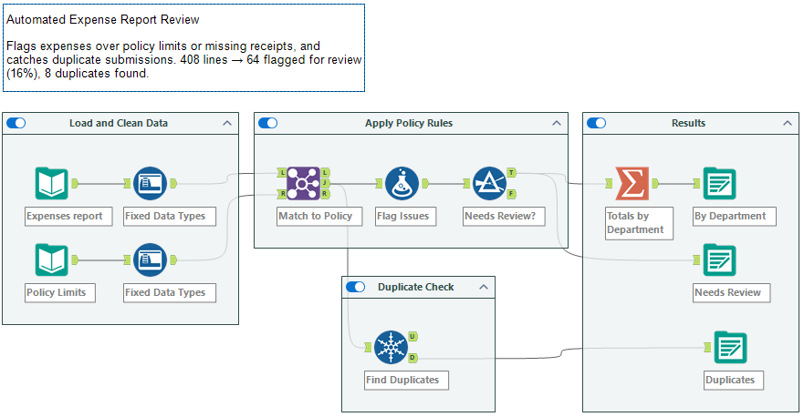

# Automated Expense Report Review (Alteryx)

**Tools:** Alteryx Designer, Excel | **Data:** simulated (408 employee expense lines, July–September 2026)

An Alteryx workflow that automates the first pass of an accounts payable expense review. It checks every expense line against company policy, flags only the lines a person needs to look at, explains why each one was flagged, and catches duplicate submissions.



## Business Problem

AP teams often review every expense report by hand to confirm it follows policy. Most expenses are fine, so reviewers spend a lot of time on items that need no action. This workflow applies the clear yes/no policy rules automatically, so reviewers can focus on the exceptions.

## Results

| Metric | Result |
|---|---|
| Expense lines reviewed | 408 |
| Over the policy limit | 38 |
| Missing a receipt | 29 |
| **Flagged for human review** | **64 (about 16%)** |
| Passed every check | 344 |
| Flagged dollar amount | $14,912.70 |
| Duplicate submissions caught | 8 |

**Flagged lines by department**

| Department | Flagged lines | Flagged amount |
|---|---|---|
| Aviation | 22 | $5,015.76 |
| Water | 18 | $4,357.47 |
| Land Development | 11 | $2,622.07 |
| Transportation | 7 | $1,131.12 |
| Energy | 6 | $1,786.28 |

**Key takeaway:** a reviewer only needs to look at 64 of 408 lines, about 84% fewer than reviewing everything by hand. Client Entertainment was the most-flagged category (21 lines).

## How the Workflow Works

| Step | Alteryx tools | What it does |
|---|---|---|
| 1. Load and clean data | Input Data, Auto Field | Loads the expense and policy files and converts text fields to numbers, so amounts compare correctly |
| 2. Apply policy rules | Join, Formula, Filter | Matches each expense to its category's policy limit, flags over-limit and missing-receipt lines, labels the reason, and keeps only lines that need review |
| 3. Duplicate check | Unique | Finds expenses submitted more than once (same employee, date, category, and amount) |
| 4. Results | Summarize, Output Data | Totals flagged spending by department and writes three Excel files |

**Policy rules in the Formula tool:**
```
Over_Limit      = IF [amount] > [policy_limit] THEN 1 ELSE 0 ENDIF
Missing_Receipt = IF [receipt_attached] = "No" THEN 1 ELSE 0 ENDIF
Needs_Review    = IF [Over_Limit] = 1 OR [Missing_Receipt] = 1 THEN 1 ELSE 0 ENDIF
Review_Reason   = "Over limit + no receipt" / "Over policy limit" / "Missing receipt" / "OK"
```

**Policy limits:** Meals $75 · Office Supplies $100 · Mileage $150 · Client Entertainment $250 · Hotel $275 · Airfare $700

## Data Quality Checks

- **Data types:** CSV fields load as text, so Auto Field converts `amount` and `policy_limit` to numbers before comparing. Without this step, text comparison can rank "95" above "100".
- **Join validation:** confirmed the Join's unmatched (L and R) outputs were empty, so every expense matched a policy category.
- **Output conflicts:** writing three sheets to one Excel file at the same time caused a file-lock error, which I solved by writing each output to its own file.

## Repository Contents

```
data/     expense_reports_sample.csv, expense_policy_limits.csv
output/   Flagged_Needs_Review.xlsx, Flagged_By_Department.xlsx, Flagged_Duplicates.xlsx
images/   workflow.png
Expense_Review.yxmd   the Alteryx workflow
```

## Next Steps with Real Data

- Check for manager approval and approval limits
- Flag expenses on weekends or holidays
- Check GL account and project coding
- Compare each employee's spending to their usual pattern to spot outliers
- Schedule the workflow to run automatically on each new batch of expense reports

---
*Built by Nikolas Zeiner · [Portfolio](https://nikolaszeiner.github.io/NikolasZeiner)*
